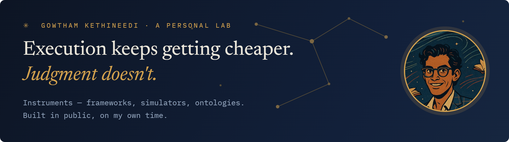

 live in market&nbsp;&nbsp;·&nbsp;&nbsp; open&nbsp;&nbsp;·&nbsp;&nbsp; wip

| S | INSTRUMENT | WHAT IT DOES | GUIDE |
|:---:|:---|:---|:---|
|  | **[gunafood](https://apps.apple.com/us/app/gunafood/id6761399298)** | Ayurvedic food wisdom — 433 foods, live on iOS & Android | [↗ App Store](https://apps.apple.com/us/app/gunafood/id6761399298) · [Play](https://play.google.com/store/apps/details?id=com.gunafood.gunafood) |
|  | **[product-skill](https://github.com/gtm-k/product-skill)** | 30+ PM frameworks as an AI skill — judgment, on tap | [↗ field guide](https://gtm-k.github.io/product-skill/) |
|  | **[eigenorg](https://github.com/gtm-k/eigenorg)** | Stress-test an org before you build it — 500 Monte Carlo runs in-browser | [↗ simulator](https://gtm-k.github.io/eigenorg/) |
|  | **[business-model-almanac](https://github.com/gtm-k/business-model-almanac)** | Every business process → the software that runs it | [↗ atlas](https://gtm-k.github.io/business-model-almanac/) |
|  | **[discern](https://github.com/gtm-k/discern)** | A disciplined buying method an AI agent can run | [↗ walkthrough](https://gtm-k.github.io/discern/) |
|  | **[fintree](https://github.com/gtm-k/fintree)** | 234-node, XBRL-mapped US GAAP P&L ontology | [↗ explorer](https://gtm-k.github.io/fintree/) |
|  | **[quantum-fusion-poc](https://github.com/gtm-k/quantum-fusion-poc)** | VQE on real IBM quantum hardware — including what doesn't work yet | [↗ results](https://gtm-k.github.io/quantum-fusion-poc/) |
|  | **[skill-forge](https://github.com/gtm-k/skill-forge)** | Local-first skill runtime for open LLMs | [↗ repo](https://github.com/gtm-k/skill-forge) |
|  | **[foldermcp](https://github.com/gtm-k/foldermcp)** | Folders → secure MCP tool servers | — |
|  | **[strategy-council](https://github.com/gtm-k/strategy-council)** | Multi-agent strategic reasoning — research | — |

> **Field notes** — just shipped [business-model-almanac](https://github.com/gtm-k/business-model-almanac); next, the new [foldermcp](https://github.com/gtm-k/foldermcp).

Personal projects, built on my own time. Views my own. · [gowthamkethineedi.com](https://www.gowthamkethineedi.com) · [LinkedIn](https://www.linkedin.com/in/gowthamkethineedi)

